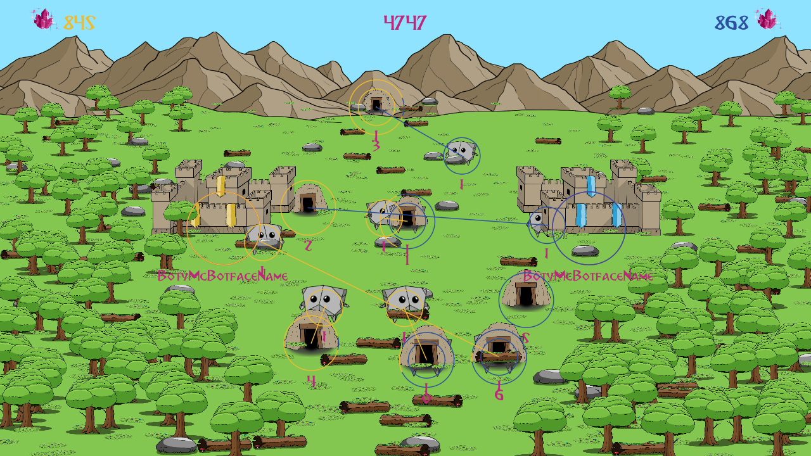

# Crushing Rocks!
A little game called Crushing Rocks that was used as the 2020 Acagamics Programming Competition.


## Installation
```
git clone git@github.com:manuelliebchen/crushingrocks.git
cd crushingrocks
git submodule update --init --remote --recursive
gradle wrapper
./gradlew run
```